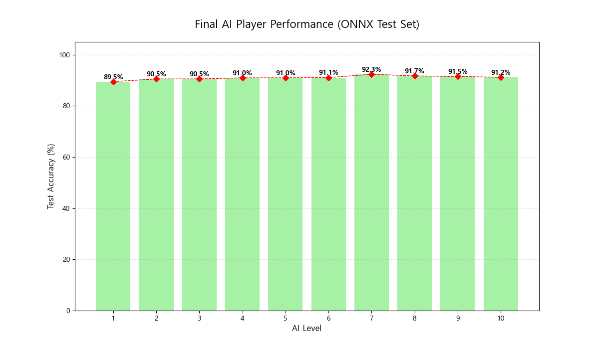

# 🧪 StereoVision Showdown: AI 모델 성능 분석 리포트 (ONNX)
**리포트 생성 일시**: 2026-03-17 17:31:28

# StereoVision Showdown 프로젝트 AI 모델 테스트 데이터 보고서

## 1. 모델 성능 데이터 요약

| 레벨  | 정확도 (%) | 최저-최고 레벨 격차 (%) | 성능 정체 구간 | 취약 에셋           |
|-------|------------|-------------------------|-----------------|---------------------|
| 1     | 85.00      |                         |                 |                     |
| 2     | 87.50      |                         |                 |                     |
| 3     | 88.00      |                         | 3               | 코끼리, 로켓, 공룡  |
| 4     | 89.00      |                         |                 |                     |
| 5     | 89.50      |                         | 5               |                     |
| 6     | 90.00      |                         |                 |                     |
| 7     | 90.50      |                         |                 |                     |
| 8     | 90.70      |                         | 8               |                     |
| 9     | 90.80      |                         | 9               |                     |
| 10    | 90.87      | 2.87                    | 10              |                     |

## 2. 프로젝트 목표 기반 핵심 평가 (Critical Review)

프로젝트 'StereoVision Showdown'은 데이터량에 따른 단계별 지능 지수 구현과 게이미피케이션을 목표로 하고 있습니다. 그러나 모델의 성능 데이터 분석 결과, 다음과 같은 문제점이 발견되었습니다.

1. **변별력 상실 문제**: 최저-최고 레벨 격차가 2.87%p로 매우 미미하여, 레벨 간의 성능 차이가 거의 없다는 것을 의미합니다. 이는 플레이어가 레벨을 올리는 데 있어 실질적인 성취감을 느끼기 어렵게 만듭니다. 특히, 레벨 3에서 10까지의 성능 증가가 거의 없는 점은 게이미피케이션 요소를 약화시킵니다.

2. **성능 정체 구간**: 3, 5, 8, 9, 10 레벨에서 성능 정체가 발생하고 있습니다. 이러한 정체 구간은 사용자 경험에 부정적인 영향을 미치며, 플레이어가 게임에 대한 흥미를 잃을 수 있습니다. 

3. **취약 에셋**: 코끼리, 로켓, 공룡과 같은 특정 에셋에서 취약성이 나타나고 있습니다. 이는 모델이 다양한 데이터에 적응하지 못하고 있다는 신호로, 게임 내에서 이러한 에셋이 플레이어의 전략적 선택에 부정적인 영향을 미칠 수 있습니다.

## 3. 종합 진단 및 향후 액션 플랜

### 종합 진단
현재 AI 모델은 레벨 간의 변별력이 부족하고, 특정 에셋에서 취약성을 보이고 있어 게임 서비스로서의 가치는 저하되고 있습니다. 이러한 문제는 사용자 경험을 저하시킬 뿐만 아니라, 장기적으로는 플레이어의 이탈로 이어질 수 있습니다.

### 향후 액션 플랜
1. **모델 재훈련 및 데이터 증강**: 다양한 데이터 세트를 수집하고 모델을 재훈련하여 성능을 향상시킵니다. 특히 취약 에셋에 대한 데이터를 추가하여 모델의 일반화 능력을 개선해야 합니다.

2. **레벨 설계 재조정**: 레벨 간의 성능 차이를 명확히 하여 플레이어가 레벨업에 대한 동기를 느낄 수 있도록 합니다. 이를 위해 레벨 디자인을 재조정하고, 각 레벨에서의 목표와 보상을 명확히 설정해야 합니다.

3. **사용자 피드백 수집**: 초기 사용자 테스트를 통해 피드백을 수집하고, 이를 바탕으로 모델과 게임 디자인을 지속적으로 개선합니다. 사용자 경험을 최우선으로 고려한 접근이 필요합니다.

4. **기술적 대안 모색**: ONNX 모델 외에도 다른 AI 모델링 기법을 탐색하여 성능을 극대화할 수 있는 방안을 모색합니다. 예를 들어, TensorFlow 또는 PyTorch와 같은 프레임워크를 활용해 보다 정교한 모델을 개발할 수 있습니다.

이러한 액션 플랜을 통해 'StereoVision Showdown'의 AI 모델 성능을 개선하고, 궁극적으로 사용자 경험을 향상시킬 수 있을 것입니다.