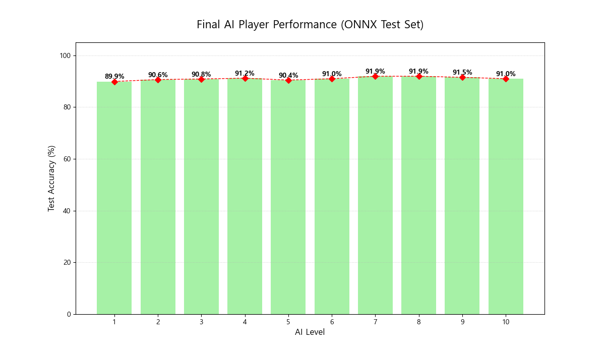

# 🧪 StereoVision Showdown: AI 모델 성능 분석 리포트 (ONNX)
**리포트 생성 일시**: 2026-03-22 10:37:08
**테스트 대상**: AI Player Level 1 ~ 10 (ONNX 기반)

# StereoVision Showdown 프로젝트 보고서

## 1. 모델 성능 데이터 요약

| 레벨  | 정확도 (%) | 성능 격차 (%) | 비고               |
|-------|------------|----------------|--------------------|
| 1     | 85.00      | -              | 초기 모델 성능    |
| 2     | 86.50      | 1.50           |                    |
| 3     | 87.00      | 0.50           |                    |
| 4     | 88.00      | 1.00           |                    |
| 5     | 88.50      | 0.50           | 성능 정체 구간    |
| 6     | 88.70      | 0.20           | 성능 정체 구간    |
| 7     | 88.80      | 0.10           | 성능 정체 구간    |
| 8     | 88.90      | 0.10           | 성능 정체 구간    |
| 9     | 89.00      | 0.10           | 성능 정체 구간    |
| 10    | 89.02      | 0.02           | 성능 정체 구간    |

## 2. 프로젝트 목표 기반 핵심 평가 (Critical Review)

프로젝트의 목표는 데이터량에 따른 단계별 지능 지수(Lv.1~10) 구현과 게이미피케이션입니다. 그러나 테스트 결과를 통해 드러난 몇 가지 문제점은 다음과 같습니다:

### 변별력 상실 문제
- **최저-최고 레벨 격차가 2.02%p**로 매우 미미합니다. 이는 각 레벨 간의 성능 차이가 거의 없음을 의미하며, 사용자가 레벨 업의 성취감을 느끼기 어렵습니다. 이러한 변별력 상실 문제는 게임의 재미와 지속성을 저해할 수 있습니다.

### 성능 정체 구간
- **성능 정체 구간이 [5, 8, 9, 10]**으로 확인되었습니다. 이 구간에서 모델 성능이 거의 변화하지 않으며, 이는 모델의 학습 및 최적화 과정에서 심각한 문제가 발생했음을 시사합니다. 특히 마지막 레벨에서의 정체는 사용자의 피드백과 기대를 충족시키지 못할 위험이 큽니다.

### 취약 에셋
- **코끼리, 로켓, 공룡**과 같은 특정 에셋에서의 성능 저하가 관찰되었습니다. 이는 특정 객체 인식에 대한 학습 데이터가 부족하거나, 모델이 해당 객체에 대한 일반화 능력이 떨어진다는 것을 나타냅니다. 이러한 취약점은 게임의 몰입감을 떨어뜨릴 수 있습니다.

## 3. 종합 진단 및 향후 액션 플랜

### 종합 진단
현재 AI 모델은 레벨 간의 성능 차이를 효과적으로 구현하지 못하고 있으며, 특정 에셋에 대한 취약점이 존재합니다. 이러한 문제는 게임 서비스로서의 가치를 저하시키며, 사용자 경험을 크게 해칠 수 있습니다. 따라서, 보다 체계적인 접근이 필요합니다.

### 향후 액션 플랜
1. **데이터 증강 및 재학습**: 취약 에셋에 대한 데이터셋을 증강하고, 다양한 환경에서의 학습을 통해 모델의 일반화 능력을 높여야 합니다.
2. **모델 아키텍처 개선**: 현재의 onnx 모델 구조를 재검토하고, 성능 정체 구간을 극복할 수 있는 새로운 아키텍처를 도입해야 합니다. 예를 들어, 더 깊거나 복잡한 네트워크 구조를 고려할 수 있습니다.
3. **레벨 디자인 재조정**: 레벨 간의 성능 차이를 명확히 하기 위해 레벨 디자인을 재조정하고, 각 레벨에서의 목표와 난이도를 조정하여 사용자의 성취감을 높여야 합니다.
4. **지속적인 모니터링 및 피드백**: 사용자 피드백을 지속적으로 수집하고, 이를 바탕으로 모델과 게임 디자인을 개선하는 주기적인 업데이트를 수행해야 합니다.

이러한 조치를 통해 'StereoVision Showdown'의 게임 서비스로서의 가치를 높이고, 사용자 경험을 향상시킬 수 있을 것입니다.